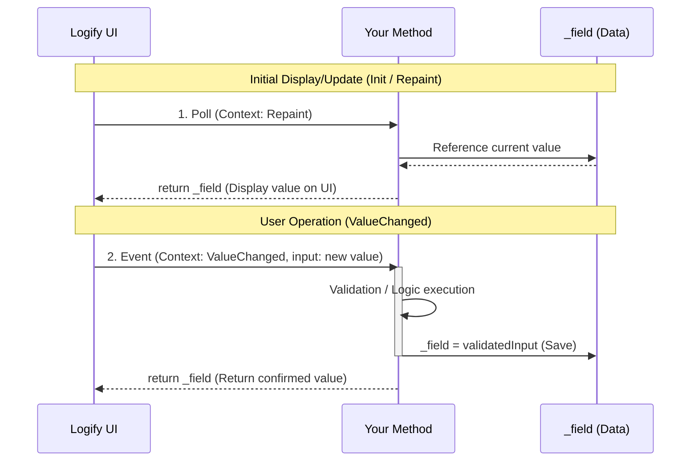

# 🎛️ Context-Driven

By adding `LogiViewContext` as a method argument, you enable **bidirectional control** based on UI lifecycle.

An advanced implementation pattern where a single method describes not just "execution (Fire)" but also "state synchronization (Sync)" and "change application (Update)".

### 📝 Implementation Example: Stateful Numeric Control

Define a return value and specify `LogiViewContext` as the second argument.

```csharp
int _integer = 10;

[LogiButton("Advanced Counter")]
int OnUpdateCounter(int input, LogiViewContext context)
{
    // 1. Processing on user input
    if (context == LogiViewContext.ValueChanged)
    {
        // Data validation and logging
        _integer = Mathf.Clamp(input, 0, 100);
        Debug.Log($"[Logify] Value changed: {_integer}");
    }
    // 2. Processing on rendering/initialization
    // Always synchronize UI display with current field value (_integer).
    return _integer;
}
```

### 🔄 Lifecycle Loop

The method is called in three contexts aligned with UI updates.

| Context | Timing | Role |
| --- | --- | --- |
| **`Init`** | Initial creation | Set default values and build cache. |
| **`Repaint`** | Rendering update | Return current value. |
| **`ValueChanged`** | Input detection | Apply user changes to internal variables (Setter). |

### Diagram: Context-Driven Processing



---

### 📖 Practical Recipe: Input, Execute, Clear Coordination

Debug menus frequently require operations like "enter string, submit, and clear input field after submission". Context-driven processing makes this extremely concise.

#### Implementation Example: Debug Message Submission

```csharp
using UnityEngine;
using Logify;

public sealed class MessageDebugger : MonoBehaviour
{
    string _currentMessage = string.Empty;

    // 1. Message input field
    // Through Repaint context, UI automatically clears when internal variable (_currentMessage) becomes empty
    [LogiInput("Message to Send")]
    string OnUpdateMessage(string input, LogiViewContext context)
    {
        if (context == LogiViewContext.ValueChanged)
        {
            _currentMessage = input;
        }
        return _currentMessage;
    }

    // 2. Send button
    // Processes on button click, then resets internal variable
    [LogiButton("Send & Clear", "Send")]
    void Send()
    {
        if (string.IsNullOrEmpty(_currentMessage))
        {
            return;
        }
        Debug.Log($"[Server] Sending: {_currentMessage}");
        // Simply clearing internal variable automatically syncs UI through Input-side Repaint
        _currentMessage = string.Empty;
    }

    void Awake() => Logi.Register(this, "Network Debug").AddTo(this);
}

```
