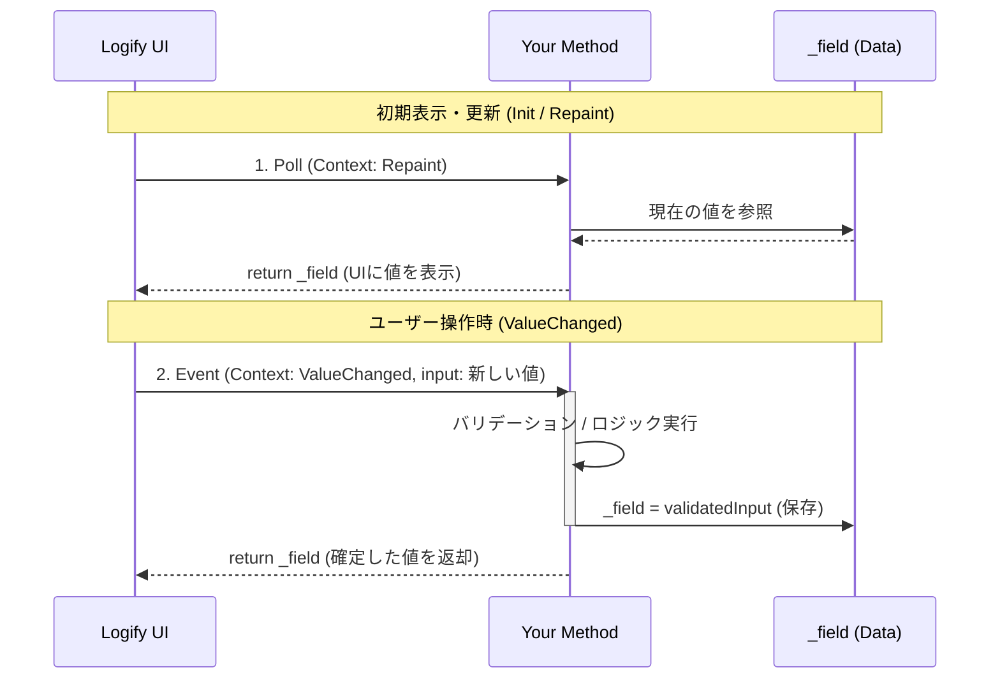

# 🎛️ コンテキスト駆動

メソッドの引数に `LogiViewContext` を追加することで、UIのライフサイクルに応じた**双方向の制御**が可能になります。

単なる「実行（Fire）」だけでなく、一つのメソッドで「状態の同期（Sync）」と「変更の適用（Update）」を記述する、高度な実装パターンです。

### 📝 実装例：ステートフルな数値制御

戻り値を定義し、第二引数に `LogiViewContext` を定義します。

```csharp
int _integer = 10;

[LogiButton("Advanced Counter")]
int OnUpdateCounter(int input, LogiViewContext context)
{
    // 1. ユーザー入力時の処理
    if (context == LogiViewContext.ValueChanged)
    {
        // データのバリデーションやロギング
        _integer = Mathf.Clamp(input, 0, 100);
        Debug.Log($"[Logify] Value changed: {_integer}");
    }
    // 2. 描画・初期化時の処理
    // UI側の表示を、常に現在のフィールド値 (_integer) と同期させます。
    return _integer;
}
```

### 🔄 ライフサイクル・ループ

メソッドは UI の更新に合わせて以下の 3 つのコンテキストで呼び出されます。

| コンテキスト             | タイミング | 役割 |
|--------------------| --- | --- |
| **`Init`**         | 初回生成時 | デフォルト値の設定やキャッシュの構築を行います。 |
| **`Repaint`**      | 描画更新時 | 現在の値を返します。 |
| **`ValueChanged`** | 入力検知時 | ユーザーの変更を内部変数に適用（Setter）します。 |

### 図解 : コンテキスト駆動処理



---

### 📖 実践レシピ：入力・実行・クリアの連携

デバッグメニューでは、「文字列を入力して送信し、送信後に入力欄を空にする」といった操作が頻繁に発生します。コンテキスト駆動処理を用いると、これを極めて簡潔に実装できます。

#### 実装例：デバッグメッセージ送信

```csharp
using UnityEngine;
using Logify;

public sealed class MessageDebugger : MonoBehaviour
{
    string _currentMessage = string.Empty;

    // 1. メッセージ入力欄
    // Repaintコンテキストにより、内部変数 (_currentMessage) が空になるとUIも自動でクリアされます
    [LogiInput("Message to Send")]
    string OnUpdateMessage(string input, LogiViewContext context)
    {
        if (context == LogiViewContext.ValueChanged)
        {
            _currentMessage = input;
        }
        return _currentMessage;
    }

    // 2. 送信ボタン
    // ボタンクリック時に処理を行い、そのあと内部変数をリセットします
    [LogiButton("Send & Clear", "Send")]
    void Send()
    {
        if (string.IsNullOrEmpty(_currentMessage))
        {
            return;
        }
        Debug.Log($"[Server] Sending: {_currentMessage}");
        // 内部変数をクリアするだけで、Input側のRepaintによってUIも自動で同期されます
        _currentMessage = string.Empty;
    }
    
    void Awake() => Logi.Register(this, "Network Debug").AddTo(this);
}

```