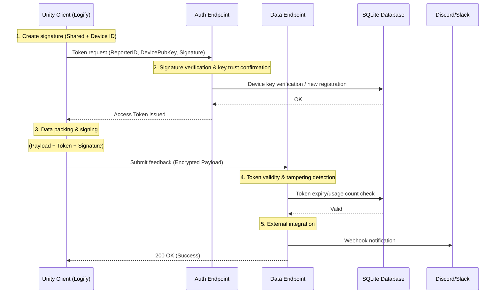

# 🧠 Technical Specification: Signature and Authentication Protocol

This plugin's server-mediated type (app configuration type) adopts a **multi-layered defense protocol** based on modern Web API best practices, not just simple password authentication.

## 🔐 Three Authentication Layers

This plugin simultaneously performs three verifications for each request.

1. **Shared Signature (HMAC-SHA256)**
* Uses `Shared Secret` (shared key).
* Both client and server hold the same key and verify payload hash. This blocks naive requests from third parties who haven't analyzed the binary.

2. **Device Signature (Asymmetric Key Signature)**
* Uses device-specific generated private key.
* Used for initial authentication, proving "that Reporter ID is actually sent from that device" (preventing impersonation).

3. **Access Token (Short-Term Token)**
* Temporary token issued by server after successful authentication.
* Has TTL (time to live), minimizing damage even if packet is captured.

---

## 🛠️ Security Communication Sequence

To prevent false feedback submissions and data tampering by malicious users, adopts a **two-stage verification process**.

### 1. Token Acquisition (Authentication)

Before starting submission, first request temporary access rights from server.

* **Nonce & Timestamp**: To prevent replay attacks (resending identical packets), assigns one-time value and expiry.
* **Device Key Persistence**: Registers device-specific public key on first access. Subsequently, access from same **Reporter ID** is rejected without valid signature from paired private key.

### 2. Feedback Submission (Data Integrity)

Using obtained token, pack and send actual data.

* **Payload Hashing**: Generates hash value encompassing all message, device info, and attachments.
* **End-to-End Signature**: Signs generated hash with device key. If data is tampered even 1 bit in transit to server, server immediately detects and discards.

---

## 🛡️ Advanced Security Features

### Key Rotation

Logify supports **key rotation on any day cycle**, considering risks of perpetually using same device key.

* Generates new key pair and signs "new public key" with old key, proving ownership while safely updating key.

### Rate Limit & Auto Block

Server-side performs following rate limiting dynamically:

* **Token Rate Limit:** Temporarily blocks clients excessively requesting tokens in short period.
* **Auto Block:** Automatically registers IP addresses repeating "invalid requests" like signature errors to blacklist.

---

## 📝 Attack Resistance

This robust protocol provides high resistance to following attacks:

* **Impersonation:** Pretending to be someone else's `Reporter ID` to send false reports.
* **Tampering:** Rewriting screenshot or log contents during transmission.
* **Replay:** Copying past successful communications to overwhelm server.

:::info Security and Performance
These complex signature calculations are processed asynchronously (Task/Await) on Unity side, designed not to impact main thread performance (FPS). Also, using **IL2CPP** further obfuscates C# layer logic, increasing safety.
:::
