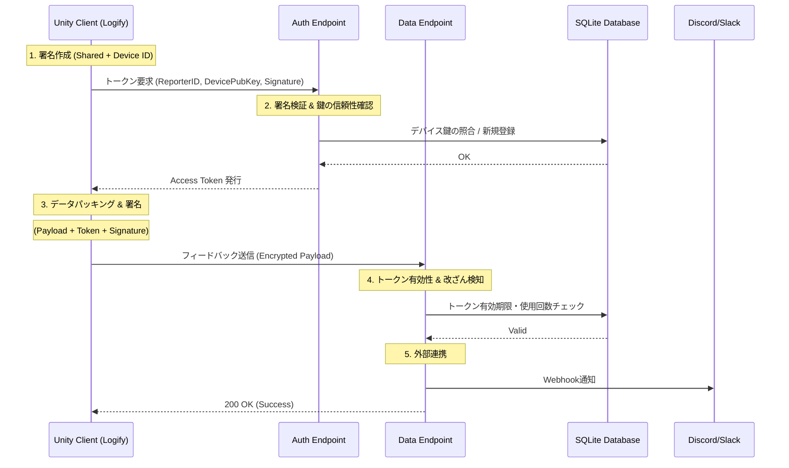

# 🧠 技術仕様：署名と認証プロトコル

本プラグインのサーバー経由型（アプリ構成型）では、単なるパスワード認証ではなく、現代的なWeb APIのベストプラクティスに基づいた**多層防御プロトコル**を採用しています。

## 🔐 3つの認証レイヤー

本プラグインは、1回のリクエストに対して以下の3つの検証を同時に行います。

1. **Shared Signature (HMAC-SHA256)**
* `Shared Secret`（共通鍵）を使用。
* クライアントとサーバー双方が同じ鍵を持ち、ペイロードのハッシュを検証します。これにより、バイナリを解析していない第三者による安易なリクエストを遮断します。

2. **Device Signature (非対称鍵署名)**
* デバイスごとに生成される固有の秘密鍵を使用。
* 初期認証に使用され、「その Reporter ID が本当にその端末から送られているか」を証明します（なりすまし防止）。

3. **Access Token (短期有効トークン)**
* 認証成功後にサーバーから発行される一時的なトークン。
* 有効期限（TTL）が設定されており、万が一パケットがキャプチャされても、被害を最小限に抑えます。

---

## 🛠️ セキュリティ・通信シーケンス

悪意のあるユーザーによる虚偽のフィードバック送信やデータの改ざんを防ぐため、**二段階の検証プロセス**を採用しています。

### 1. トークンの取得（Authentication）

送信を開始する前に、まずサーバーへ一時的なアクセス権を要求します。

* **Nonce & Timestamp**: リプレイ攻撃（同一パケットの再送）を防ぐため、1回限りの値と有効期限を付与します。
* **Device Key Persistence**: 初回アクセス時にデバイス固有の公開鍵を登録します。以降、同一の **Reporter ID** からは、ペアとなる秘密鍵による正当な署名がない限りアクセスを拒否します。

### 2. フィードバックの送信（Data Integrity）

取得したトークンを用いて、実際のデータをパッキングして送信します。

* **Payload Hashing**: メッセージ、デバイス情報、添付ファイルのすべてを包含したハッシュ値を生成します。
* **End-to-End Signature**: 生成したハッシュをデバイス鍵で署名します。これにより、サーバーに届くまでの経路でデータが 1 ビットでも改ざんされた場合、サーバー側で即座に検知・破棄されます。

---

## 🛡️ 高度なセキュリティ機能

### キーローテーション (Key Rotation)

Logifyは、同一のデバイス鍵を永遠に使い続けるリスクを考慮し、**任意の日周期でのキーローテーション**をサポートしています。

* 新しい鍵ペアを生成し、古い鍵で「新しい公開鍵」に対して署名を行うことで、所有権を証明しながら安全に鍵を更新します。

### レートリミット & オートブロック

サーバー側で以下の流量制限を動的に行います。

* **Token Rate Limit:** 短時間にトークンを過剰に要求するクライアントを一時的にブロック。
* **Auto Block:** 署名エラーなどの「不正なリクエスト」を繰り返すIPアドレスを自動的にブラックリストへ登録します。

---

## 📝 攻撃に対する耐性

この堅牢なプロトコルにより、以下の攻撃に対して高い耐性を持ちます。

* **なりすまし:** 他人の `Reporter ID` を語って偽の報告を送る。
* **改ざん:** 送信途中のスクリーンショットやログの内容を書き換える。
* **リプレイ:** 過去に成功した通信をコピーしてサーバーをパンクさせる。

:::info セキュリティとパフォーマンス
これら複雑な署名計算は、Unity側では非同期（Task/Await）で処理され、メインスレッドのパフォーマンス（FPS）に影響を与えないよう設計されています。また、 **IL2CPP** を使用することで、C#層のロジック自体も難読化され、より安全性が高まります。
:::